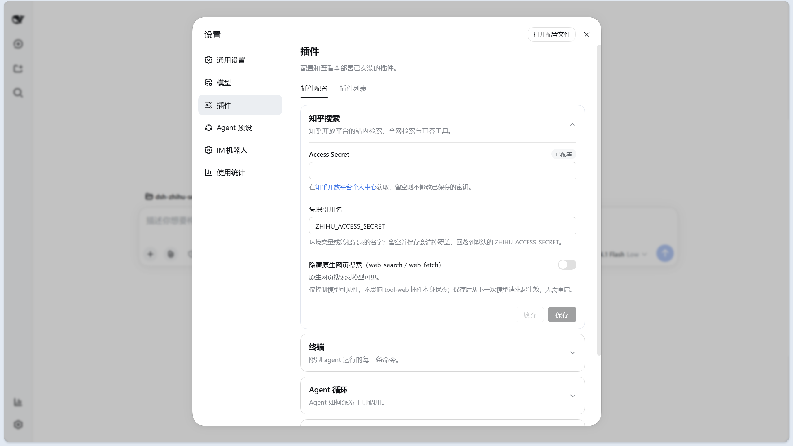

<p align="center">
  <h1 align="center">dsh-zhihu-search</h1>
</p>

<p align="center">
  
</p>

<div align="center">
  <p><strong>赋予 DeepSeek Harness 检索知乎社区的能力</strong></p>
  <p><em>Empowering DeepSeek Harness with Zhihu Insights</em></p>

  <p>
    <a href="https://developer.zhihu.com/"></a>
    <a href="https://github.com/deepseek-ai/deepseek-harness"></a>
    <a href="https://github.com/topics/dsh-plugin"></a>
  </p>

  <p>
    <a href="https://github.com/zlZayn/dsh-zhihu-search/actions/workflows/ci.yml"></a>
    <a href="https://www.npmjs.com/package/dsh-zhihu-search"></a>
    <a href="LICENSE"></a>
    <a href="https://slsa.dev/"></a>
  </p>

  <p>
    <strong><a href="README.md">简体中文</a></strong> · <a href="README_en.md">English</a>
  </p>
</div>

---

> [!NOTE]
> **基于知乎开放平台官方 API 构建**，非爬虫抓取。所有检索结果均附带可引用的原始链接，知乎站内结果另附点赞数，让模型的每一次回答都有据可查。搜索结果为文字摘要，不含正文图片。

给 DSH 装上知乎：站内检索、全网检索与直答三个工具，返回可引用的来源列表，而不是一段无法核对的摘要。

<p align="center">
  
  <br>
  <em>在 <strong>设置 → 插件 → 插件配置</strong> 中与其他插件并排，Access Secret 就地填写、立即生效。</em>
</p>

## 工具一览

装上后模型多出三个工具：

| 工具 | 一句话说明 | 适用场景 |
|---|---|---|
| `zhihu_search` | 知乎站内问答与文章搜索，支持按点赞/评论/时间排序 | 中文经验、产品评测、行业讨论、技术实践 |
| `zhihu_global_search` | 知乎全网索引搜索，可按域名和时间过滤；结果会混入知乎站内内容 | 查找特定网站上的公开资料 |
| `zhihu_zhida` | 知乎直答，成体系的综合性回答 | 需要「先检索再总结」的复杂中文问题 |

下面三个小节是每个工具的完整参数与能力边界。模型只看到下表中的语义化参数——知乎原生的字符串查询语法由插件内部编译，模型接触不到，也就不可能写错。

### `zhihu_search` —— 站内检索

| 参数 | 类型 | 默认 | 说明 |
|---|---|---|---|
| `query` | string | **必填** | 搜索关键词，中文效果最好。 |
| `count` | integer | `5` | 返回条数，1–10。 |
| `sortField` | enum | `default` | `default` 沿用相关性排序；`voteUpCount` 点赞数 · `commentCount` 评论数 · `editTime` 更新时间。 |
| `order` | enum | `desc` | `desc` 降序 · `asc` 升序。仅在指定了 `sortField` 时生效。 |
| `minValue` | number | — | 排序字段的下限（含），**必须配合 `sortField`**。配 `sortField=voteUpCount` + `minValue=100` 即「只要点赞数 ≥ 100」。 |
| `publishedAfter` | string | — | 只要该日期之后发布的内容，格式 `YYYY-MM-DD`。 |
| `publishedBefore` | string | — | 只要该日期之前发布的内容，格式 `YYYY-MM-DD`。 |

**边界**：不支持按站点域名过滤——站内结果本来就全来自知乎，要按站点找资料请用 `zhihu_global_search`。`count` 上限 10。`minValue` 与非默认 `order` 必须配合 `sortField`：缺了会被拒绝并给出改正提示，而不是静默返回未过滤的结果。**没有翻页**：`hasMore` 恒为 `false`，要更多结果请换关键词或换排序。

### `zhihu_global_search` —— 全网索引检索

| 参数 | 类型 | 默认 | 说明 |
|---|---|---|---|
| `query` | string | **必填** | 搜索关键词。 |
| `count` | integer | `8` | 返回条数，1–20，比站内宽。 |
| `site` | string | — | 只搜该域名，例如 `github.com`。传完整 URL 会被自动剥成主机名。 |
| `publishedAfter` | string | — | 只要该日期之后发布的内容，格式 `YYYY-MM-DD`。 |
| `publishedBefore` | string | — | 只要该日期之前发布的内容，格式 `YYYY-MM-DD`。 |
| `searchDb` | enum | `all` | `all` 全部 · `realtime` 偏最新 · `static` 偏长期收录。 |

**边界**：**没有排序参数**——该端点会忽略排序字段，与其给模型一个转不动的旋钮，不如不给。**也没有翻页参数**：单次最多 20 条，超出由服务端截断。`site` 不接受 `zhihu.com` 及其子域，知乎会直接拒绝该请求。结果里**会混入知乎站内内容**；要专搜知乎的问答和文章，用 `zhihu_search`。

### `zhihu_zhida` —— 直答

| 参数 | 类型 | 默认 | 说明 |
|---|---|---|---|
| `question` | string | **必填** | 要提问的问题，中文描述越具体越好。 |
| `mode` | enum | `thinking` | `fast` 快速回答 · `thinking` 深度思考 · `agent` 智能体多步检索。 |
| `includeReasoning` | boolean | `false` | 是否把推理过程一并返回。默认关闭以节省上下文，核对答案可靠性时可打开。 |

**边界**：它**不是搜索**——返回的是一段生成回答，不是来源列表。答案由知乎生成，可能有误，重要结论请自行核对。思维链默认不返回。

## 能力

- 三个工具职责不重叠：站内捞经验、全网捞资料、直答做综合，模型按问题类型自行选择。
- 搜索返回结构化来源条目（标题 / 链接 / 摘要 / 作者 / 点赞数），每条都带 URL，可直接引用核对。
- 结果同时渲染为来源卡片与纯 Markdown，任何界面都能读。

## 安装

### 前置

- DSH `0.1.5-rc.2`
- Node `>= 20`

### 从源码安装

```bash
git clone https://github.com/zlZayn/dsh-zhihu-search.git
cd dsh-zhihu-search
npm install && npm run build

dsh plugin --profile web add "$PWD"
```

`dsh plugin` 会把本包装进 profile 并挂进 `dsh.profile.bundles`。重启 `dsh --profile web` 后生效。

### 从 npm 安装

```bash
dsh plugin --profile web add dsh-zhihu-search
```

### 发现与安装

- **npm**：[`dsh-zhihu-search`](https://www.npmjs.com/package/dsh-zhihu-search)
- **GitHub**：[`zlZayn/dsh-zhihu-search`](https://github.com/zlZayn/dsh-zhihu-search)

仓库带有 GitHub topic [`dsh-plugin`](https://github.com/topics/dsh-plugin)，插件市场据此自动发现插件。

## 配置

### 在设置界面填写

打开 **设置 → 插件 → 插件配置 → 知乎搜索**，填入 Access Secret 并保存。保存后立即生效，无需重启 DSH。

Access Secret 在[知乎开放平台个人中心](https://developer.zhihu.com/profile)获取；设置卡片里有同一个链接。

### 用环境变量代替

不想把密钥存在设置里时，改用环境变量 `ZHIHU_ACCESS_SECRET`；或在卡片的「凭据引用名」里填别的名字，指向另一个环境变量或凭据记录。

## 安全与边界

- Access Secret 只在设置界面、凭据域与环境变量之间流转：不写日志、不以明文进入缓存键、不进仓库。
- 返回内容按外部不可信数据处理：摘要剥离 HTML 标签，链接剥离跟踪参数。
- 只访问 `developer.zhihu.com`，不代理、不转发其他流量。

## 许可

[MIT](LICENSE)。

## 贡献

维护者文档地图见 [AGENTS.md](AGENTS.md)；不变的设计约束见 [docs/ARCHITECTURE.md](docs/ARCHITECTURE.md)；发布流程见 [docs/PUBLISHING.md](docs/PUBLISHING.md)。
