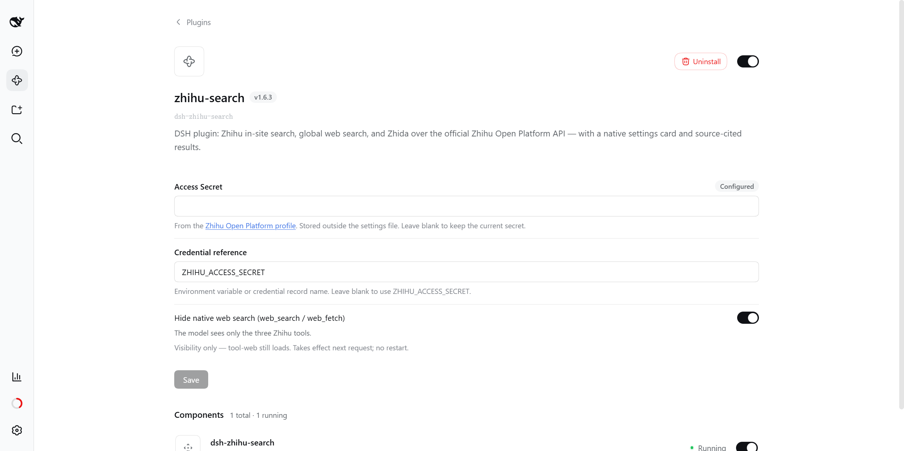
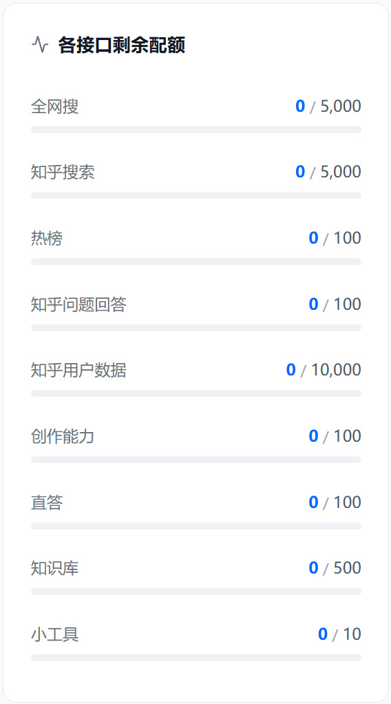

<p align="center">
  <h1 align="center">dsh-zhihu-search</h1>
</p>

<p align="center">
  
</p>

<div align="center">
  <p><strong>Empowering DeepSeek Harness with Zhihu Insights</strong></p>
  <p><em>赋予 DeepSeek Harness 检索知乎社区的能力</em></p>

  <p>
    <a href="https://developer.zhihu.com/"></a>
    <a href="https://github.com/deepseek-ai/deepseek-harness"></a>
  </p>

  <p>
    <a href="https://github.com/zlZayn/dsh-zhihu-search/actions/workflows/ci.yml"></a>
    <a href="https://www.npmjs.com/package/dsh-zhihu-search"></a>
    <a href="LICENSE"></a>
    <a href="https://www.npmjs.com/package/dsh-zhihu-search"></a>
  </p>

  <p>
    <a href="README.md">简体中文</a> · <strong><a href="README_en.md">English</a></strong>
  </p>
</div>

---

> [!NOTE]
> **Built on the official Zhihu Open Platform API**, not web scraping. All search results include citable original links, and Zhihu's own results also carry their upvote counts, ensuring every model response is verifiable. Search results are text summaries only and do not include article images.

Grounded search. Cited answers. Three Zhihu tools for DSH: in-site search, global web search, and Zhida direct answers — returning a list of citable sources instead of an unverifiable summary.

<p align="center">
  
  <br>
  <em>Lives on the <strong>Plugins</strong> panel, on the bundle's details page under Installed. Enter your Access Secret and it takes effect immediately.</em>
</p>

## Tools

Installing adds three tools to the model:

| Tool | One line | Use it for |
|---|---|---|
| `zhihu_search` | Searches Zhihu's own questions and articles; sortable by votes / comments / time | Chinese experience, product reviews, industry discussion, engineering practice |
| `zhihu_global_search` | Searches Zhihu's global web index; the results mix in some Zhihu content | Finding material on a specific site |
| `zhihu_zhida` | Zhihu Zhida: a synthesized answer that pulls a topic together | Complex Chinese questions that need "retrieve, then summarize" |

The three sections below are each tool's full parameter set and limits. The model only ever sees the semantic parameters in these tables — Zhihu's native string query syntax is compiled inside the plugin, so the model cannot get it wrong.

### `zhihu_search` — in-site search

| Parameter | Type | Default | Notes |
|---|---|---|---|
| `query` | string | **required** | Search keywords; works best in Chinese. |
| `count` | integer | `5` | Number of results, 1–10. |
| `sortField` | enum | `default` | `default` keeps relevance order; `voteUpCount` upvotes · `commentCount` comments · `editTime` time (published or last edited). |
| `order` | enum | `desc` | `desc` or `asc`. Only applies when `sortField` is set. |
| `minValue` | number | — | Inclusive lower bound on the sort field, **requires `sortField`**, non-negative integer. **It screens the candidates retrieved by this call only**: when few qualify you get fewer than `count` — that does not mean Zhihu has no highly upvoted content. |
| `publishedAfter` | string | — | Only content published after this date, `YYYY-MM-DD`. |
| `publishedBefore` | string | — | Only content published before this date, `YYYY-MM-DD`. |

**Limits**: no domain filter — in-site results all come from Zhihu anyway; use `zhihu_global_search` to search a specific site. `minValue` and a non-default `order` require `sortField`, otherwise the call is rejected with a hint. **No pagination**: for more results change the keywords or the sort. **The lower bound screens candidates**: when it winnows the list the results say so, and an empty result does not mean Zhihu has no highly upvoted content.

### `zhihu_global_search` — global web index search

| Parameter | Type | Default | Notes |
|---|---|---|---|
| `query` | string | **required** | Search keywords. |
| `count` | integer | `8` | Number of results, 1–20 — wider than in-site. |
| `site` | string | — | Only this domain, e.g. `github.com`. A full URL is reduced to its host, and a leading `www.` is dropped. |
| `publishedAfter` | string | — | Only content published after this date, `YYYY-MM-DD`. |
| `publishedBefore` | string | — | Only content published before this date, `YYYY-MM-DD`. |
| `searchDb` | enum | `all` | `all` · `realtime` newest · `static` long-term index. |

**Limits**: the domain is matched **exactly**, so subdomains must be listed separately (`qq.com` does not reach pages on `news.qq.com`), and Zhihu domains are rejected. **There is no sorting parameter** (the endpoint ignores sorting), **and no pagination parameter**. The results mix in some Zhihu content; to search Zhihu's own questions and articles specifically, use `zhihu_search`.

### `zhihu_zhida` — Zhida

| Parameter | Type | Default | Notes |
|---|---|---|---|
| `question` | string | **required** | The question; the more specific you are, the better. |
| `mode` | enum | `thinking` | `fast` quick answer · `thinking` deep reasoning · `agent` multi-step retrieval. |
| `includeReasoning` | boolean | `false` | Also return the reasoning trace. Off by default to save context; turn it on when checking an answer. |

**Limits**: this is **not a search** — it returns a generated answer, not a list of sources. The answer is generated by Zhihu and may be wrong; verify anything that matters. The reasoning trace is omitted by default.

## Capabilities

- The three tools do not overlap: in-site for experience, global index for material, Zhida for synthesis — the model picks by question type.
- Search returns structured source entries (title / URL / snippet / author / upvotes / comments / date), every one carrying a URL, so results can be cited and checked.
- The result text states its own boundaries: hitting the per-call cap, mixing in external pages, or a filter winnowing the candidates are all spelled out, so the tool's limits are not mistaken for the world's.
- Results render both as source cards and as plain Markdown, so they stay readable anywhere.

## Install

### Requirements

- **DSH `0.1.5-rc.2` or newer, below `0.2.0`** — the range declared in [package.json](package.json)'s `peerDependencies`.
- Node `>= 20`

Install the host from an **explicit dist-tag**: `latest` for `@deepseek-ai/dsh` points at `0.1.5-rc.1`, **one prerelease below what this plugin requires**, so a default install lands outside the declared range.

```bash
npm install -g @deepseek-ai/dsh@next     # the line this plugin commits to
```

Compatibility is measured, not inferred: [compat.yml](.github/workflows/compat.yml) swaps the DSH packages onto the `next` and `alpha` lines every week and runs the existing suite. Current results and what to do when a line breaks: [docs/PUBLISHING.md](docs/PUBLISHING.md).

### From source

```bash
git clone https://github.com/zlZayn/dsh-zhihu-search.git
cd dsh-zhihu-search
npm install && npm run build

dsh plugin --profile web add "$PWD"
```

`dsh plugin` installs the package into the profile and lists it in `dsh.profile.bundles`. Restart `dsh --profile web` to pick it up.

### From npm

```bash
dsh plugin --profile web add dsh-zhihu-search
```

### Discovery and install

- **npm**: [`dsh-zhihu-search`](https://www.npmjs.com/package/dsh-zhihu-search)
- **GitHub**: [`zlZayn/dsh-zhihu-search`](https://github.com/zlZayn/dsh-zhihu-search)

The repository carries the GitHub topic [`dsh-plugin`](https://github.com/topics/dsh-plugin), which is how plugin marketplaces discover plugins.

## Configuration

The configuration UI registers into the Host's `plugins.bundle.config` slot, and **that slot arrives with DSH 0.1.6**: on an earlier Host the three tools keep working, but the configuration area never appears on the Plugins page (silently, with no error) — that is the watershed. To configure in place, run the Host at **`0.1.6-alpha.2` or newer**.

### On the Plugins page

Open the **dsh-zhihu-search** details page under **Plugins → Installed**, enter the Access Secret and save. It takes effect immediately, with no DSH restart.

The key goes into DSH's credential store (`~/.dsh/.credentials.yaml`), **never into the settings file** — `settings.yaml` holds only the reference name, so it is safe to screenshot or share.

Get the Access Secret from the [Zhihu Open Platform profile](https://developer.zhihu.com/profile); the config card links to the same place.

### Daily quota

Quotas settle per calendar day, and the per-endpoint readings live in the [Zhihu Open Platform profile](https://developer.zhihu.com/profile) — the same place you get the Access Secret. This is what that panel looks like:

<p align="center">
  
</p>

### Point at another credential source

The card's "Credential reference" defaults to `ZHIHU_ACCESS_SECRET`. Put a different name there to point elsewhere.

The key resolves through DSH's layers, highest first:

- Process environment variable (`export ZHIHU_ACCESS_SECRET=…`)
- Credential store (`~/.dsh/.credentials.yaml`)
- `.env` in the project directory
- `~/.dsh/.env`

When a read-only source (an environment variable) supplies the reference, the card disables its input and says so — a value there cannot be overridden.

### Advanced: timeouts and limits

Plugin options live in the `Config` of [src/index.ts](src/index.ts) (edit the plugin config in `cordis.patch.yml`). Two timeouts are worth knowing:

- `timeoutMs` (default 15s): per-request budget for searches.
- `streamTimeoutMs` (default 55s): budget for reading a whole Zhida stream; the Zhida tool's timeout follows it automatically. Raising the request timeout never shrinks it (the larger of the two wins), so this is the one to raise.

### Zhihu results only

The card's "Hide native web search (web_search / web_fetch)" switch is off by default — the plugin does not quietly remove host capabilities. Turn it on and save, and the model no longer sees DSH's native `web_search` and `web_fetch`, leaving only the three Zhihu tools.

- Applies from the **next model request**: no restart, no new window.
- Agents derived from that one follow the same rule.
- Visibility only: the tool-web plugin still loads, and switching it back off restores the tools.

## Security and boundaries

- The Access Secret only travels between the config card, the credential scope and the environment: never logged, never in a cache key in clear text, never committed.
- Returned content is treated as untrusted external data: snippets are stripped of HTML tags, URLs of tracking parameters.
- Only `developer.zhihu.com` is contacted; nothing is proxied or forwarded.

## License

[MIT](LICENSE).

## Contributing

External entry point (what a bug report needs, what to read before proposing a feature, what to do before opening a PR) → [CONTRIBUTING_en.md](CONTRIBUTING_en.md).

Design stance: tool parameters and result text are an **API for the model** first and documentation for humans second — the writing rules live in [docs/ARCHITECTURE.md](docs/ARCHITECTURE.md) under "Tool description conventions" and "Honesty of model-visible text".

Maintainer doc map in [AGENTS.md](AGENTS.md); the design constraints that do not change in [docs/ARCHITECTURE.md](docs/ARCHITECTURE.md); the release process in [docs/PUBLISHING.md](docs/PUBLISHING.md).
